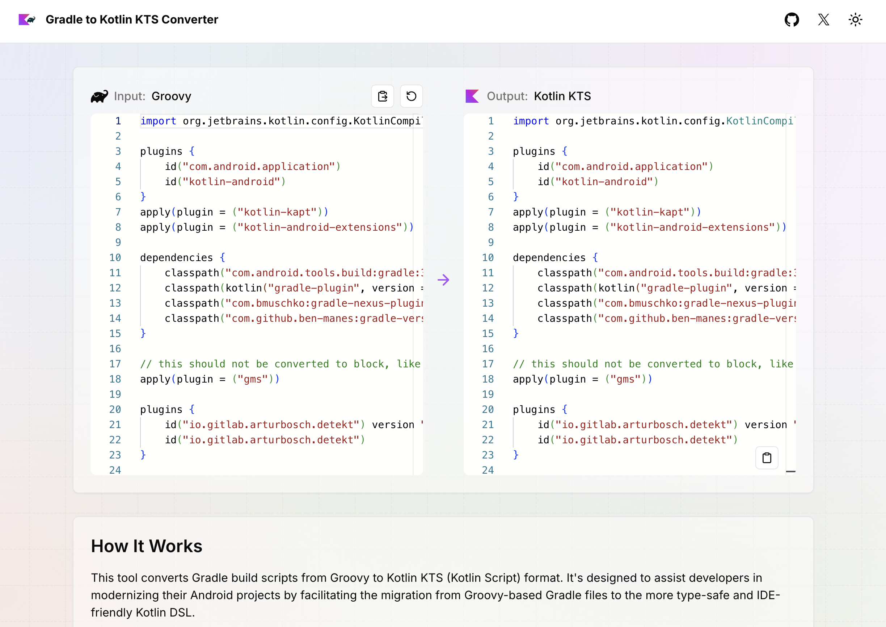

# Gradle Kotlin DSL Converter

A powerful tool to simplify the migration from Gradle's Groovy DSL to Kotlin DSL for Android projects.

Visit https://gradle-kotlin-converter.vercel.app/ to use the converter.

## Overview

The Gradle Kotlin DSL Converter is designed to streamline the process of transitioning from Gradle's Groovy DSL to Kotlin DSL in Android Studio. This tool automates many of the repetitive tasks involved in the migration, significantly reducing the time and effort required to update your build scripts.

While it may not produce a perfect conversion in all cases, it serves as an invaluable first step in the migration process, similar to Android Studio's Java to Kotlin converter.

## Features

- Converts Groovy-style Gradle scripts to Kotlin DSL format
- Handles common syntax differences and idiomatic changes
- Supports both file-based and clipboard-based conversion
- Addresses numerous edge cases and common migration challenges

## Getting Started

### Web Interface

Visit our [web-based converter](https://gradle-kotlin-converter.vercel.app/) for an easy-to-use interface that doesn't require any local setup.

## Conversion Capabilities

The converter handles a wide range of Gradle script elements, including:

- String delimiter conversion (apostrophes to quotation marks)
- Variable declaration updates (`def` to `val`)
- Plugin application syntax
- Dependency declaration format
- Repository and Maven configurations
- SDK version and build type declarations
- ProGuard file configurations
- Kotlin-specific dependency declarations
- And more:

---

<table>
    <th>Description</th>
    <th>Before</th>
    <th>After</th>
    <tr>
        <td>Replace all ' with "</td>
        <td>'kotlin-android'</td>
        <td>"kotlin-android"</td>
    </tr>
    <tr>
        <td>Replace "def " with "val "</td>
        <td>def appcompat = "1.0.0"</td>
        <td>val appcompat = "1.0.0"</td>
    </tr>
    <tr>
        <td>Convert plugins</td>
        <td>apply plugin: "kotlin-kapt"</td>
        <td>apply(plugin = "kotlin-kapt")</td>
    </tr>
    <tr>
        <td>Add ( ) to dependencies</td>
        <td>implementation ":epoxy"</td>
        <td>implementation(":epoxy")</td>
    </tr>
    <tr>
        <td>Convert Maven</td>
        <td>maven { url "https://jitpack.io" }</td>
        <td>maven("https://jitpack.io")</td>
    </tr>
    <tr>
        <td>Convert Sdk Version</td>
        <td>compileSdkVersion 28</td>
        <td>compileSdkVersion(28)</td>
    </tr>
    <tr>
        <td>Convert Version Code</td>
        <td>versionCode 4</td>
        <td>versionCode = 4</td>
    </tr>
    <tr>
        <td>Convert Build Types</td>
        <td>debuggable true</td>
        <td>isDebuggable = true</td>
    </tr>
    <tr>
        <td>Convert proguardFiles</td>
        <td>proguardFiles getDef..., "..."</td>
        <td>setProguardFiles(listOf(getDef..., "...")</td>
    </tr>
    <tr>
        <td>Convert sourceCompatibility</td>
        <td>sourceCompatibility = "1.8"</td>
        <td>sourceCompatibility = JavaVersion.VERSION_1_8</td>
    </tr>
    <tr>
        <td>Convert androidExtensions</td>
        <td>androidExtensions { experimental = true }</td>
        <td>androidExtensions { isExperimental = true }</td>
    </tr>
    <tr>
        <td>Convert include</td>
        <td>include ":app", ":diffutils"</td>
        <td>include(":app", ":diffutils")</td>
    </tr>
    <tr>
        <td>Convert signingConfigs</td>
        <td>signingConfigs { debug { ... } }</td>
        <td>signingConfigs { register("debug") { ... } }</td>
    </tr>
    <tr>
        <td>Convert buildTypes</td>
        <td>buildTypes { debug { ... } }</td>
        <td>buildTypes { named("debug") { ... } })</td>
    </tr>
    <tr>
        <td>Convert classpath.exclude</td>
        <td>configurations.classpath.exclude group: '...lombok'</td>
        <td>configurations.classpath { exclude(group = "...lombok") }</td>
    </tr>
    <tr>
        <td>Kt dependencies (1/3)</td>
        <td>"org.jetbrains.kotlin:kotlin-gradle-plugin:$kt_v"</td>
        <td>kotlin("gradle-plugin", version = "$kt_v")</td>
    </tr>
    <tr>
        <td>Kt dependencies (2/3)</td>
        <td>"org.jetbrains.kotlin:kotlin-stdlib:$kt_v"</td>
        <td>kotlin("stdlib")</td>
    </tr>
    <tr>
        <td>Kt dependencies (3/3)</td>
        <td>"org.jetbrains.kotlin:kotlin-reflect"</td>
        <td>kotlin("reflect")</td>
    </tr>
    <tr>
        <td>Convert signingConfig</td>
        <td>signingConfig signingConfigs.release</td>
        <td>signingConfig = signingConfigs.getByName("release")</td>
    </tr>
    <tr>
        <td>Convert extras</td>
        <td>ext.enableCrashlytics = false</td>
        <td>extra.set("enableCrashlytics", false)</td>
    </tr>
    <tr>
        <td>Convert plugins</td>
        <td>apply(...) apply(...)</td>
        <td>plugins { id(...) id(...) }</td>
    </tr>
    <tr>
        <td>Convert plugin ids</td>
        <td>id "io.gitlab.arturbosch.detekt" version "1.0"</td>
        <td>id("io.gitlab.arturbosch.detekt") version "1.0"</td>
    </tr>
    <tr>
        <td>Convert ":" to " ="</td>
        <td>testImpl(name: "junit", version: "4.12")</td>
        <td>testImpl(name = "junit", version = "4.12")</td>
    </tr>
</table>

You can find all the details on the source code.

The script was made to convert `build.gradle` in `build.gradle.kts`, but it can also help in the migration if you paste something that is not in Kotlin DSL format
and you want it converted. If you paste something like a `implementation '...'` and want it converted to `implementation("...")`, you are free to call the script on `build.gradle.kts` file and see it working as expected.

When applying on `build.gradle`, the script will create, for example, `build.gradle.kts`.
When applying on a file that already ends in `.kts`, the script will overrite the file.
In that case, please make sure you are using git or have a backup, in case things turn out wrong.

## Things it still can't do

- If you find anything, just tell me.

## Issue Tracking

Found a bug? Have an idea for an improvement? Feel free to [add an issue](../../issues).

## License

Copyright 2018 Bernardo Ferrari.

Licensed to the Apache Software Foundation (ASF) under one or more contributor
license agreements. See the NOTICE file distributed with this work for
additional information regarding copyright ownership. The ASF licenses this
file to you under the Apache License, Version 2.0 (the "License"); you may not
use this file except in compliance with the License. You may obtain a copy of
the License at

http://www.apache.org/licenses/LICENSE-2.0

Unless required by applicable law or agreed to in writing, software
distributed under the License is distributed on an "AS IS" BASIS, WITHOUT
WARRANTIES OR CONDITIONS OF ANY KIND, either express or implied. See the
License for the specific language governing permissions and limitations under
the License.
