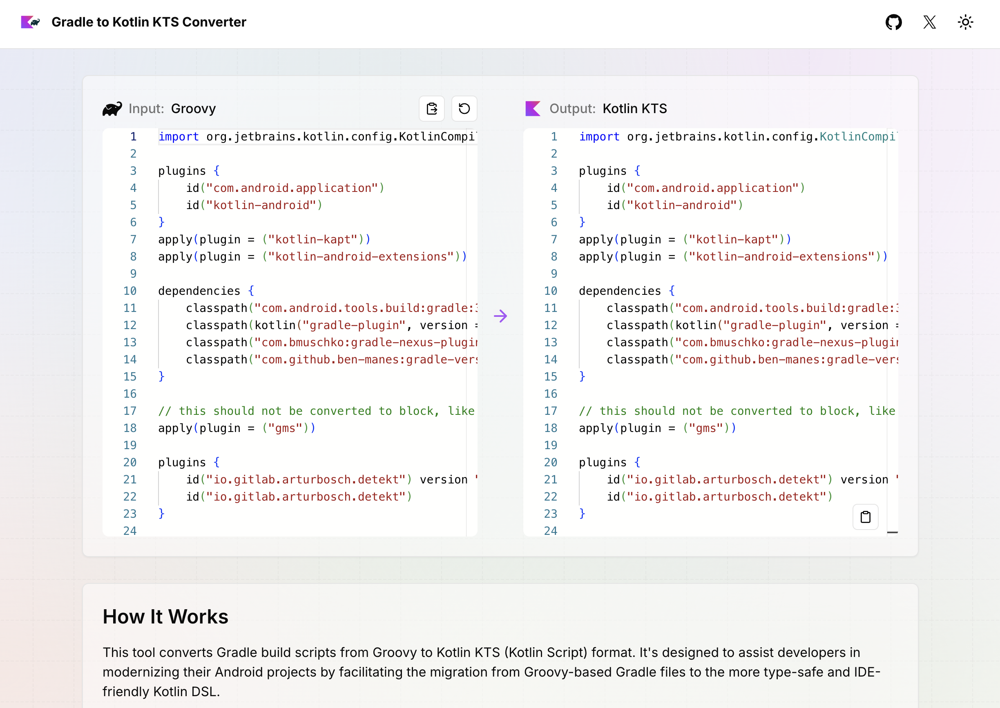

[](https://gradlekotlinconverter.app/)

# Gradle Kotlin DSL Converter

A powerful tool to simplify the migration from Gradle's Groovy DSL to Kotlin DSL for Android and other Gradle projects.

[](https://gradlekotlinconverter.app/)

Visit https://gradlekotlinconverter.app/ to use the converter.

## Overview

This tool helps you migrate Gradle build scripts from Groovy DSL to Kotlin DSL. It automates the repetitive mechanical changes so you can focus on the parts that actually need manual attention.

It works with Android projects as well as pure JVM, Kotlin, and other Gradle builds. Think of it like Android Studio's Java → Kotlin converter — a powerful starting point rather than a perfect one-shot solution.

## Features

- Converts Groovy Gradle scripts to Kotlin DSL
- Handles the most common syntax and idiomatic changes
- Supports Android, JVM, Kotlin, and general Gradle projects
- Adds helpful migration warnings for deprecated AGP APIs
- Works great as a first step (like the Java → Kotlin converter)

## Getting Started

### Web Interface

Visit the [online converter](https://gradlekotlinconverter.app/) — no setup required.

### Local CLI

```bash
cd web
pnpm install

pnpm cli build.gradle
pnpm cli build.gradle > build.gradle.kts
```

### Kotlin Script

```bash
kotlinc -script kotlin/gradlekotlinconverter.kts build.gradle
# or
./kotlin/gradlekotlinconverter.kts build.gradle
```

The Kotlin script has full feature and test parity with the TypeScript version.

### Developing the project

```bash
cd web
pnpm install
pnpm test
```

Tests are a mix of focused unit tests and full-file golden fixtures in `web/app/fixtures/golden/`. The `web/` implementation is the primary one and includes extra features like AGP migration warnings.

## Supported Transformations

The converter handles the most common Groovy-to-Kotlin DSL changes. Here are some of the most frequently used transformations:

| Description                    | Before                                      | After                                              |
|--------------------------------|---------------------------------------------|----------------------------------------------------|
| Strings                        | `'kotlin-android'`                          | `"kotlin-android"`                                 |
| Variables                      | `def appcompat = "1.0.0"`                   | `val appcompat = "1.0.0"`                          |
| Apply plugins                  | `apply plugin: "kotlin-kapt"`               | `apply(plugin = "kotlin-kapt")`                    |
| Dependencies                   | `implementation ":epoxy"`                   | `implementation(":epoxy")`                         |
| Maven repositories             | `maven { url "https://jitpack.io" }`        | `maven("https://jitpack.io")`                      |
| SDK versions (legacy)          | `compileSdkVersion 28`                      | `compileSdk = 28`                                  |
| SDK versions (modern)          | `compileSdk 36`                             | `compileSdk = 36`                                  |
| Version code / name            | `versionCode 4`                             | `versionCode = 4`                                  |
| Build types                    | `debuggable true`                           | `isDebuggable = true`                              |
| ProGuard                       | `proguardFiles getDefault...`               | `setProguardFiles(listOf(getDefault...))`          |
| Source compatibility           | `sourceCompatibility = "1.8"`               | `sourceCompatibility = JavaVersion.VERSION_1_8`    |
| Includes                       | `include ":app", ":diffutils"`              | `include(":app", ":diffutils")`                    |
| Signing configs                | `signingConfigs { debug { ... } }`          | `signingConfigs { register("debug") { ... } }`     |
| Build types                    | `buildTypes { debug { ... } }`              | `buildTypes { named("debug") { ... } }`            |
| Kotlin dependencies            | `"org.jetbrains.kotlin:kotlin-stdlib:$v"`   | `kotlin("stdlib")`                                 |
| Plugin blocks                  | Multiple `apply(plugin = ...)`              | `plugins { id(...) ... }`                          |
| Extras                         | `ext.kotlin_version = '2.1.20'`             | `extra["kotlin_version"] = "2.1.20"`               |

The converter also supports many modern Gradle patterns, including:

- Version catalogs, `platform()` dependencies, and `includeBuild`
- `fileTree(mapOf(...))` and `artifacts { add(...) }`
- `buildFeatures`, `testOptions`, and Kotlin compiler options
- Modernization of legacy `*SdkVersion` declarations
- Helpful AGP migration warnings (variantFilter, RenderScript, density splits, etc.)

See the [golden fixtures](web/app/fixtures/golden/) and [`web/app/logic.ts`](web/app/logic.ts) for the complete set of rules and realistic before/after examples.

The tool works on both `.gradle` and `.kts` files. Even if you paste just a dependency line like `implementation '...'`, it will correctly add parentheses and quotes.

## Limitations

The converter is a best-effort tool (similar to Android Studio's Java → Kotlin converter). It will not perfectly handle every case:

- Complex custom Groovy logic, helper methods in buildSrc, or heavy metaprogramming
- Some `ext { }` blocks containing closures (the tool inserts `// TODO` comments for manual review)
- Certain legacy or removed AGP/Gradle features that require larger architectural changes (the tool adds `// TODO(AGP)` notes where relevant)
- Every third-party plugin's custom DSL extensions

Always review the output, run a Gradle sync, and test your build. For tricky cases, the golden fixtures and focused regression tests document current behavior.

## Issue Tracking

Found a bug? Have an idea for an improvement? Feel free to [add an issue](../../issues).
